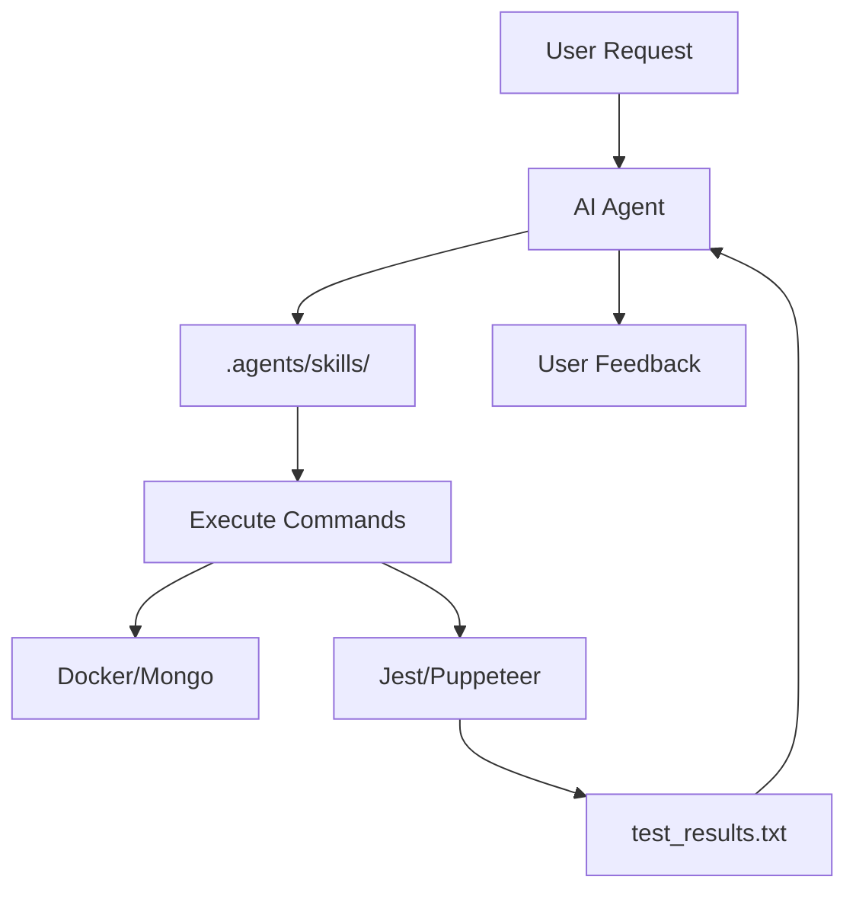

# Agentic QA Architecture

## Overview
The agentic architecture of this project is designed to bridge the gap between AI reasoning and the technical infrastructure of the Wild Rift QA suite.

## Components
1. **The Agent (Antigravity)**: The reasoning engine that interprets user requests and executes skills.
2. **Skill Library (`.agents/skills/`)**: The modular set of capabilities available to the agent.
3. **Project Core**:
   - **BFF (Node.js/Express)**: The system under test.
   - **Database (MongoDB/Docker)**: Persistent storage.
   - **Test Runner (Jest/Puppeteer)**: The automation engine.

## Interaction Flow

## Environment Integration
The agent has direct access to the terminal and filesystem, allowing it to:
- Monitor container health.
- Parse JSON data files.
- Run and debug Puppeteer scripts in real-time.
