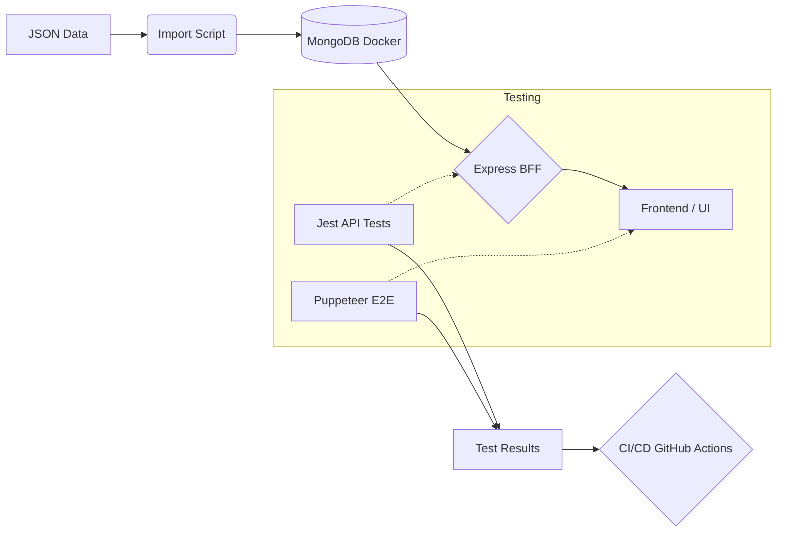

# Quality Assurance Architecture

## 1. Testing Strategy
Our QA strategy follows a multi-layered approach to ensure reliability from data ingestion to user interaction.

### Layers:
- **Data Validation**: Automated checks on `champions.json` and `objetos.json` to prevent corrupt data from reaching the database.
- **Code Quality (Linting)**: Static analysis using ESLint to enforce standards and catch common bugs.
- **Integration Tests (API)**: Verifying that the Express BFF correctly retrieves and filters data from MongoDB.
- **End-to-End (E2E) Tests**: Using **Puppeteer** to simulate user behavior in a real browser environment, validating UI elements, navigation, and search functionality.

## 2. Technical Stack
| Component | Technology | Role |
|-----------|------------|------|
| Test Runner | **Jest** | Framework for executing and reporting all automated tests. |
| Browser Automation | **Puppeteer** | Drives the headless browser for E2E scenarios. |
| Infrastructure | **Docker** | Provides a containerized MongoDB instance for consistent testing environments. |
| Mocking/Data | **JSON Files** | Seed data used to populate the test database. |

## 3. Workflow Diagram

## 4. Environment & CI/CD
- **Local Development**: Managed via `docker-compose.yml` to ensure developers and testers use the same DB version.
- **Continuous Integration**: Managed via `.github/workflows/ci.yml`. Every push triggers a fresh environment, data import, and full test suite execution.

## 5. Reporting
Test results are aggregated in `test_results.txt` for local audits and visualized in the GitHub Actions dashboard for remote runs.
